# Projet de S4-TI - détection de visages

Dans le cadre de notre projet de fin d'étude, nous allons réaliser un module de reconnaissance de visage pour systèmes embarqués.

## OpenCV

OpenCV qui signifie Open Computer Vision est une bibliothèque open source initialement développée par Intel et qui est spécialisée dans le traitement de l’image. Elle permet de coder des programmes en langage C++, Python ou Java. Dans le cadre de notre projet, nous allons utiliser OpenCV en langage C++ et Python.
La bibliothèque OpenCV met à disposition de nombreuses fonctionnalités très diversifiées permettant de créer des programmes. Elle propose la plupart des opérations classiques en traitement bas niveau des images comme lecture, écriture et affichage d’une image ou bien le filtrage, lissage ou seuillage d’image et bien d’autres…
 
 
Nous allons utiliser OpenCV 3.4 et 4 voici comment l'installer.

### Installer Opencv et ses exemples avec CMake,
Prérequis :
 
Télécharger Opencv : https://github.com/opencv/opencv pour choisir la version d'OpenCV changer de branche.

Télécharger Opencv_contrib : https://github.com/opencv/opencv_contrib qui sera utile pour OpenCV 4.

Télécharger  Cmake gui :  https://cmake.org/download/ 

Télécharger VSCode : https://code.visualstudio.com/download 

### 1) Ouvrir Cmake gui et chercher votre fichier Opencv et votre Build.
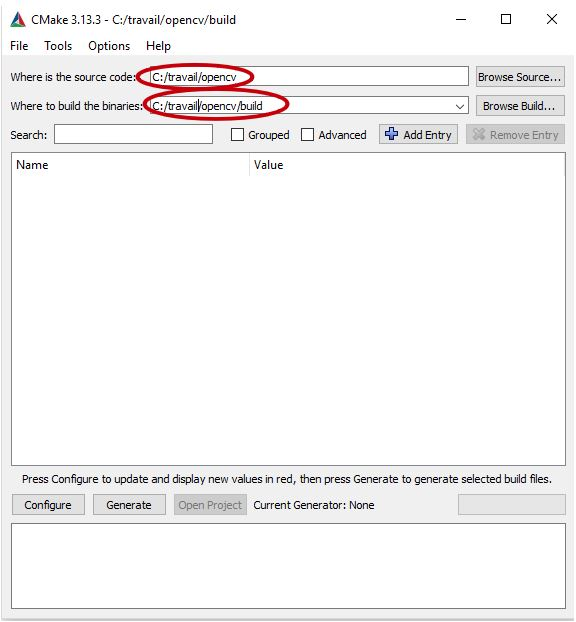
 
 
 

### 2) Configurer Opencv.
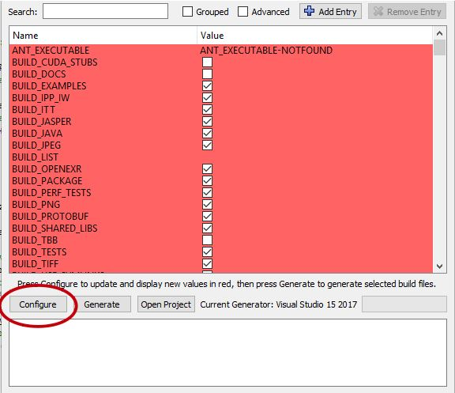
 
 
 

### 3) Changer les paramètre suivant, vous pouvez vous aider de la barre de recherche.
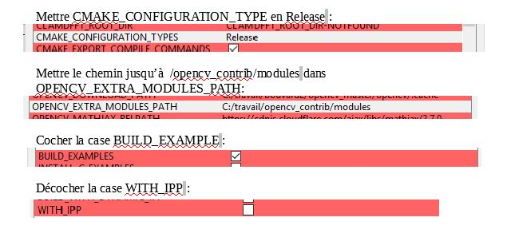
 
 
 

### 4) Reconfigurer et générer Opencv paramétré.
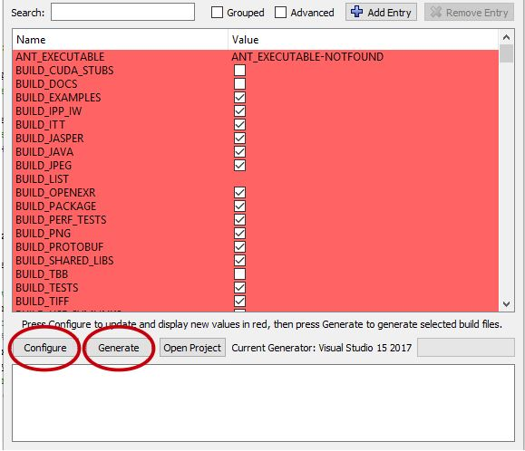
 
 
 

### 5) Maintenant nous allons aller sur VS Code afin d’installer les modules complémentaire de Opencv. Ouvrir Opencv dans VS Code et installer les extensions CMake proposées.
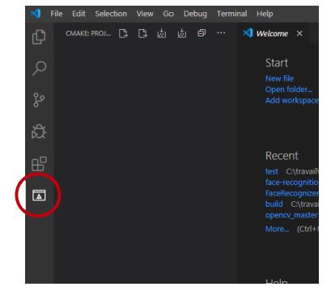
 
 
 

### 6) Appuyer sur le logo configure et choisisser le mode "...amd64_arm"
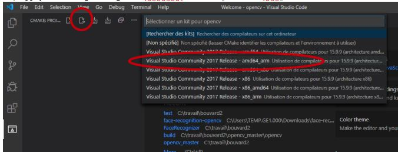
 
 
 

### 7) Apres la configuration appuyer sur le logo build.
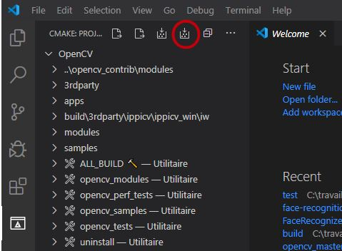
 
 
 

### 8) Si le terminal affiche La build s'est achevée avec le code de sortie 0  vous avez terminer! Opencv et Opencv_contrib sont opérationnels.
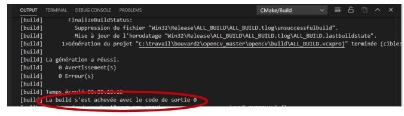
 
 
 

### 9) Si le terminal affiche La build s'est achevée avec le code de sortie 1  cela signifie une erreur, alors aller dans le fichier .\opencv\build\bin et supprimer tout ce qui si trouve, vérifier les étapes précédente, notamment les erreurs qui peuvent être indiquer dans les terminaux et refaite la procédure depuis le début. Pour la partie sur VS Code vous pouvez aussi utiliser les touches suivantes :
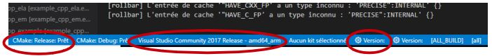
 
 
 

## Algorithme LBP

Le modèle binaire local (LBP en anglais) sont des caractéristiques utilisées en vision par ordinateur pour reconnaître des textures.

### Définition d'une image numérique

Une image est définie par un nombre de pixels en hauteur et en largeur. Chaque pixel est la résulante de la synthèse additive de nuance de rouge, bleu, vert (codage RGB).
Chaque nuances de couleurs sont codées sur 8 bits donc elles peuvent prendre 256 valeurs : 0 à 255.

 
 
 
 
 
 
 
 
 
 
 
 
 
 
 

### Principe

Le principe est d'étiqueter les pixels d'une image en seuillant le voisinage de chaque pixel et considèrer le résultat comme un nombre binaire sur 8 bits.
Ce traitement est possible si on prend pas en compte les pixels des bords de l'image car ils ne possèdent pas assez de pixels à leur voisinnage.

On prend les 8 pixels dans l'ordre des aiguilles d'une montre autour du pixel choisi :
* On compare chaque pixels avoisinnants avec le pixel choisi.
 
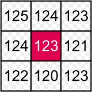
 
 
 
 
 
* Si le pixel au voisinage est plus grand ou égal que le pixel choisi alors le pixel avoisinnant prend la valeur binaire "1" sinon il vaut "0".
 
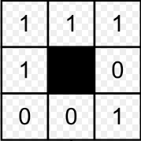
 
 
 
 
 
* Le premier pixel comparé correspond au LSB (bit 0) et le dernier au MSB (bit 7).
 
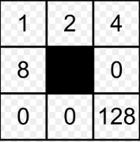
 
 
 
 
 
* Le pixel choisi se voit attribué la valeur décimale des bits avoisinnants.
 
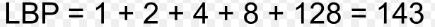
 

### Mise en pratique

Nous allons maintenant transformer une image avec l'algorithme LBP. Pour ce faire nous allons utiliser une photo de Barack Obama disponible ci-dessous et un script python disponible sur GitHub (https://github.com/brosierge1/projet-vision/blob/algorithme-LBP/python/script.py).
     

 

Après traitement, on obtient le résultat suivant : 

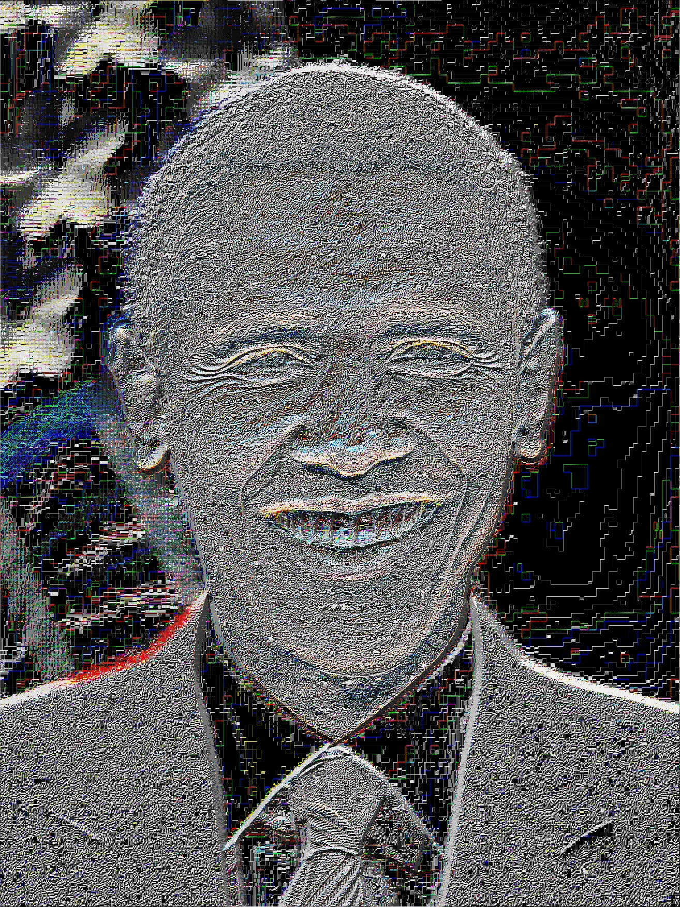
 

Comme nous pouvons le voir le visage de Barack Obama est composé d'une nuance de gris particulière ce qui permet de reconnaître son visage.

## Entraînement du classifieur cascade avec une seule image du visage à détecter

Le classifieur cascade permet théoriquement de reconnaître des visages en entraînant ce classifieur de la manière suivante.

* Images négatives

Les images négatives sont des images qui ne contiennent le visage avec lequel on veut entrainer le classifieur. Il nous faut un grand nombre d'images négatives (environ 2000), pour en acquérir autant nous ne pouvons pas le faire à la main ce qui nous prendrait énormement de temps c'est pour cela qu'on va utliser un petit programme en langage Python.
Ce script a besoin pour fonctionner des modules "OpenCV" pour le traitement des images, "Numpy" pour les calculs numériques et "Urllib" pour gérer les URLs.
Le script est écrit de la manière suivante: 
 

 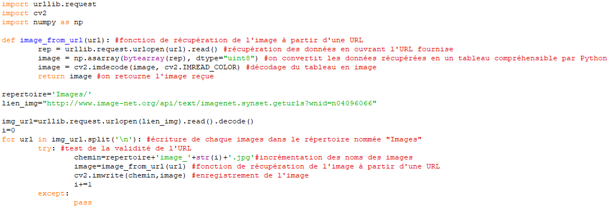 
 
 
 
 
 
 
 
 
 

* Images positives

Les images positives sont des images qui contiennent le visage à reconnaître. Il en faut aussi un très grand nombre mais il faut aussi connaître les coordonnées de la postition du visage dans l'image ainsi que le nombre d'occurence du visage.
 
 
On ne peut pas réaliser cela à la main puisque cela serait trop long. Par chance, OpenCV propose un outil, opencv_createsample, permettant de créer des images positives à partir d’une seule image d’entrée.
 
 
Nous avons donc besoin d’une image contenant uniquement notre visage à reconnaître et de créer un nouveau dossier "positives" qui contiendra les images positives. Afin d'utiliser opencv_createsample, on écrit la commande de la manière suivante dans le terminal : "opencv_createsamples -img stop.png -bg negatives.txt -info positives/positives.lst -pngoutput -num 600". 
 
 
Cette commande nous permet de générer 600 images positives à partir des images négatives et un fichier "positives.lst" qui contient les informations relatives aux images positives.
Le fichier ressemble à ceci :
 

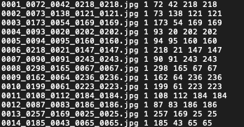 
 
 
 
 
 
 
 
 
 
 
 
 

Le resultat obtenu ressemble à ceci :
 
 
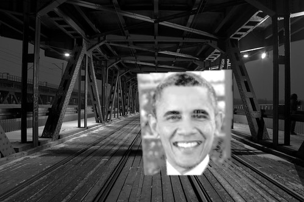
 
 
 
 
 
 
 
 
 
 
 
 
 
 
 

* Fichier descripteur

Maintenant que nous avons nos images positives, nous devons créer un fichier binaire rassemblant toutes les images positives, afin de les utiliser pour l’apprentissage. Pour ce faire, nous allons une fois de plus utiliser open_cv_create_sample qui nous permet facilement de générer ce fichier. 
 
 
On écrit la commande de la manière suivante dans le terminal : "opencv_createsamples -info positives/positives.lst  -num 600 -w 24 -h 24 -vec positives.vec"
 
 
Les arguments pris en compte sont la liste des images positives (-info), la destination de notre fichier de sortie (-vec), le nombre d’échantillons à prendre en compte (-num) et la taille en pixel des échantillons (-w et -h).

*  Apprentissage du classificateur

Tout est prêt, nous pouvons passer à l’apprentissage du classificateur.

Nous commençons par créer un dossier data qui contiendra notre classificateur. Puis nous appelons l’outil "opencv_traincascade", qui permet d’entraîner une cascade.
 
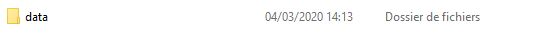
 
Cet outil prend en argument le dossier qui contiendra le classificateur entraîné (-data), notre fichier descripteur postives.vec (-vec), la liste des images négatives (-bg).
 
 
Nous indiquons également le nombre d’images positives (-numPos) et le nombre d’images négatives (-numNeg) qui seront utilisés à chaque itération. Le nombre d’images à utiliser doit être inférieur au nombre d’images disponible. Enfin, nous indiquons le nombre de itérations à entraîner (-numStages) ainsi que la taille, en pixel des échantillons (-w -h).
 
 
On écrit alors la commande de la manière suivante dans le terminal : "opencv_traincascade -data data -vec positives.vec -bg negatives.txt -numPos 550 -numNeg 600-numStages 20 -w 24 -h 24"
 
 
Entraîner un classificateur prend un certain temps : 33 minutes dans mon cas et dépend fortement du nombre d’itérations que vous avez spécifié. Pour chaque itération, un fichier stageXX.xml est créé. Cela permet de pouvoir arrêter l’apprentissage et reprendre de le reprendre à la dernière itération connue. Lorsque l’entraînement se termine un fichier cascade.xml est créé et on obtient cet affichage dans le terminal : 
 
 
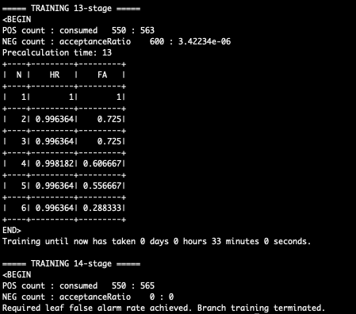

 
 
 
 
 
 
 
 
 
 
 
 
 
 
 
 
 
 
 

* Test du classificateur 

Maintenant que l'on possède notre classificateur, il nous reste plus qu'à le tester avec le script suivant : 
 
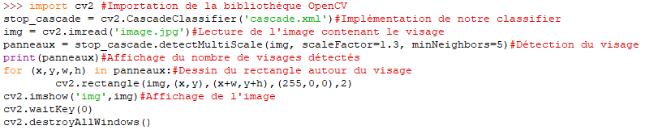
 
On utilise comme visage à détecter ce de Barack Obama avec l'image suivante :
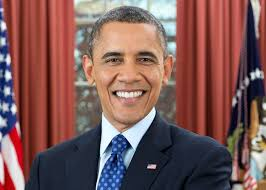
 
On obtient le résultat suivant :
 
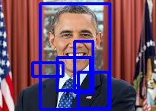
 
Comme on peut le voir le classifier a réussi à détecter le visage mais il y a eu 4 autres détections parisites.

 

## Entraînement du classifieur cascade avec plusieurs images du visage à détecter

* Rassembler les visages 

Afin de pouvoir entraîner un nouveau classificateur, nous avons besoin d’un grand nombre d’images positives et d’un nombre encore plus élevé d'images négatives.
 
 
Dans notre cas, on a 10 photos du visage à reconnaître et 200 images négatives qui ont été générées précèdemment.
 
 
Maintenant qu'on a ces images, il faut créer un fichier contenant la liste des images négatives avec la commande suivante : "find ./negatives/ -name '*.jpg' > negatives.txt"
 
 
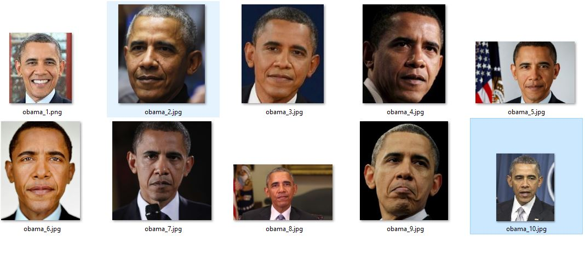
 
Puis il faut aussi créer un fichier contenant la liste des images du visage à reconnaître avec la commande suivante : "find ./positives/ -name '*.jpg' > positives.txt" 
 
 

* Générer les images positives

Pour ce faire, nous pouvons appeler la fonction opencv_createsamples pour chaque image positive. Cela nous permet de générer de nouvelles images puis de générer les fichiers descripteurs. Cependant appeler cette fonction à la main sera très long.

Pour faciliter cette opération, nous pouvons appeler un nouveau script : "createsamples.pl". Ce script est disponible sur GitHub (https://github.com/mrnugget/opencv-haar-classifier-training). Cet outil permet, pour chaque image du visage à reconnaître, de générer automatiquement les images positives en appelant plusieurs fois l’outil opencv_createsamples. De plus les fichiers descripteurs sont également générés lors de l’appel de cette fonction.
 
 
On utilise la fonction de la manière suivante : perl createsamples.pl positives.txt negatives.txt samples 1000 "opencv_createsamples -maxxangle 1.1 -maxyangle 1.1 maxzangle 0 -maxidev 20 -w 20 -h 20"
 
 
Nous devons donc fournir lors de l’appel de l’outil un certain nombre d’informations. Tout d’abord, nous spécifions les listes des images positives et négatives. Puis, nous indiquons le chemin vers le dossier où seront stockés les fichiers descripteurs (samples). Enfin nous fxons le nombre d’images positives que nous voulons générer. Dans cet exemple, j’ai décidé de générer 1000 images, soit 100 nouvelles images par image initiale.

* Rassembler les fichiers descripteurs

L’appel du script createsamples.pl, nous permet de générer facilement les fichiers descripteurs pour chaque image positive initiale. L’ensemble de ces fichiers descripteurs ont été stockés dans le dossier samples.
 
 
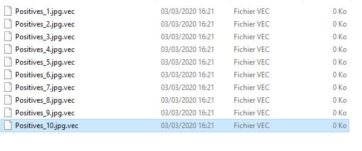
 
Nous devons maintenant ces fichiers dans un seul fichier descripteur afin de pouvoir entrainer le classificateur. Pour ce faire, nous allons appeler le programme mergevec.py qui permet de regrouper tous les fichiers descripteurs. Ce programme est disponible sur GitHub (https://github.com/wulfebw/mergevec).
 
 
On éxécute le programme en tapant la commance suivante : "python3 mergevec.py -v samples -o out.vec"
 
 
Ce programme prend en option le dossier contenant les descripteurs (-v), et le fichier à générer (-o).

* Entrainer le classificateur

Maintenant que nous avons notre fichier descripteur, nous devons entraîner le classificateur.
 
Mais avant cela, créons un dossier qui contiendra notre classificateur et les différents fichiers générés à chaque étape de l’entraînement. Il s'agit du dossier "data" 
 

Maintenant, comme avec l'entraînement du classifieur cascade avec une image du visage à détecter nous allons utliser l'éxécutable opencv_traincascade de la manière suivante afin d'entrainer le classifier : 
 
 
"opencv_traincascade -data data -vec out.vec -bg negatives.txt -numPos 780 -numNeg 200 -numStages 20 -w 20 -h 20"
 
 
Ce commande prend du temps à s'éxécuter comme avec l'entraînement du classifieur cascade avec une image du visage à détecter.
 
 
Cet outil prend en argument le dossier qui contiendra le classificateur entraîné (-data), notre fichier descripteur postives.vec (-vec), la liste des images négatives (-bg).

Nous indiquons également le nombre d’images positives (-numPos) et le nombre d’images négatives (-numNeg) qui seront utilisés à chaque itération. Le nombre d’images à utiliser doit être inférieur au nombre d’images disponible. Enfin, nous indiquons le nombre de itérations à entraîner (-numStages) ainsi que la taille, en pixel des échantillons (-w -h).

* Test du classificateur

Une fois l'entrînement fini, il suffit d'utiliser le même script qui a permis l'entrainement du classifieur cascade avec une image du visage à détecter mais il faut seulement changer le fichier xml. 
 
Voici le résulat avec une photo de Barack Obama
 
 
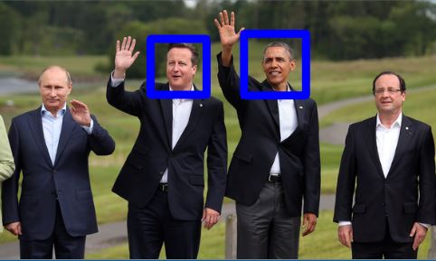
 

Comme on peut le voir le classifier a réussi à détecter des visages. Néanmoins, il n'arrive pas à détecter le visage de Barack Obama en particulier.
On en déduit la limite du classifier : il n'arrive pas à détecter un visage en particulier.
On a donc trouvé une nouvelle solution : le recognizer.

## Nouvelle solution : Recognizer

Le recognizer est une méthode qui permet, à l'aide d'un classifieur cascade, de détecter un visage mais aussi de le reconnaître à partir d'une base de données. Nous allons utiliser la dernière version d'OpenCV (OpenCV 4) qui contient l'outil "example_face_facerec_video" qui permet de faire fonctionner le recognizer.
 
 
Cet outil a besoin de trois élements pour fonctionner : une entrée vidéo, un classifieur cascade entraîné et un fichier CSV.
 
 
Pour ce qui est de l'entrée vidéo nous allons utliser une webcam et pour le classifieur entraîné nous allons utiliser le classifieur cascade fourni par OpenCV.

### Création du fichier CSV

Un fichier CSV est un fichier qui contient les chemins des images des visages à reconnaître.
 
Tout d'abord, il nous faut des photos des visages à reconnaître.
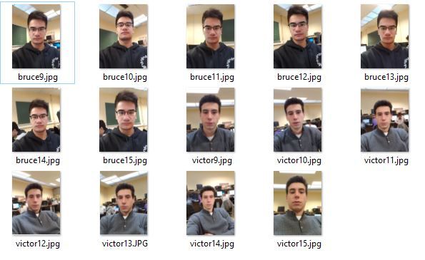
 
Mais ces images n'ont pas toutes les mêmes dimensions ce qui pose problème au recognizer. Il faut donc les redimmensionner en les recentrant par rapport à la position des yeux. Pour ce faire, nous allons utiliser un script en Python disponible sur GitHub (https://github.com/vbouvardge1/projet-vision/tree/facerecognizer). 
 
 
Après redimmensionnement des images, on obtient ceci :
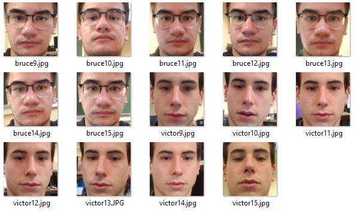
 
Maintenant nous pouvons créer notre fichier CSV. Il doit réspecter une syntaxe particulière : il est composé du chemin de l'image suivi d'un point virgule puis d'un indice qui caractérise ce visage. On répète cette syntaxe pour toutes les images.
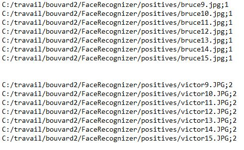

### Test du recognizer

Nous avons désormais tous les éléments pour faire fonctionner le recognizer. Pour cela, nous allons utiliser l'outil "example_face_facerec_video" de la manière suivante : 
 
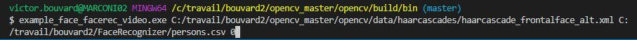
 
Comme dit précèdemment cet exécutable prend 3 arguments. Le premier est le classifieur cascade, le deuxième est le fichier CSV et le troisième est l'indice de l'entrée vidéo (0 correspond à la webcam externe de l'ordinateur).
 
 
Une fois l'exécutable lancé, on obtient ceci : 
 
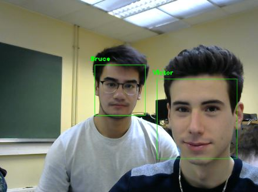
 
On observe que cette fois-ci on arrive à détecter des visages mais on arrive aussi à reconnaître le visage détecté. Nous avons résolu le problème du classifieur cascade. Néanmoins, chaque visage détecté doit être affilié à un visage dans la base de donnée. 