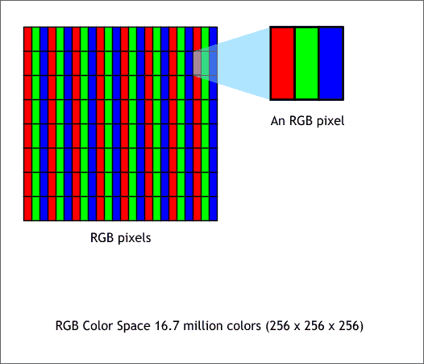

# Projet de S4-TI - détection de visages

## Algorithme LBP

Le modèle binaire local (LBP en anglais) est un opérateur de texture simple mais très efficace qui étiquette les pixels d'une image en seuillant le voisinage de chaque pixel et considère le résultat comme un nombre binaire

### Définition d'une image numérique

Une image est définie par un nombre de pixels en hauteur et en largeur. Chaque pixel est la résulante de la synthèse additive de nuance de rouge, bleu, vert (codage RGB).
Chaque nuances de couleurs sont codées sur 8 bits donc elles peuvent prendre 256 valeurs : 0 à 255.

