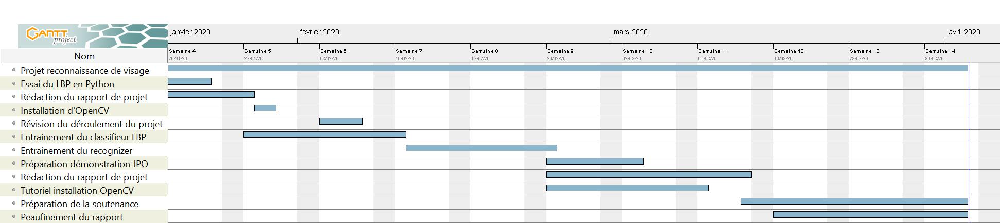

Dans le cadre de notre projet de fin d'étude, nous allons réaliser un module de reconnaissance de visage pour systèmes embarqués.

# Préambule

La vision par ordinateur est un thème que l'on retrouve partout dans les technologies modernes. Elle peut se définir comme la transformation des données reçues que ce soit des images ou des vidéos en données (est-ce que l'objet voulu est dans le champ de vision) ou en nouvelles données (transformation d'une image en couleur en une image noir & blanc). 

Le concept de vision, pour l'être humain, est une notion très simple : nous pouvons reconnaître des objets très facilement. Ceci est possible grâce à notre cerveau. Le cerveau humain fait passer le signal de vision reçu par l'oeil dans plusieurs canaux (ou synapses) qui vont chacun extraire des informations différentes. Il identifie dans l’image les informations pertinentes à examiner et ignore les informations non pertinentes. 

Les informations pertinentes repartent dans le sens inverse afin de ”recalibrer” les canaux et ”recalibrer” l’oeil en réponse au traitement du cerveau. C'est le cas pour :
- L’iris réglera spécifiquement la luminosité
- La surface rétinienne réglera spécifiquement la réception du signal

Le traitement des signaux de vision est réitéré en permanence par le cerveau, il cerveau ne cesse d'apprendre. Chaque traitements fait appel aux traitements précédents issus de plusieurs années d’expérience ce qui permet de traiter les informations aussi rapidement et spontanément.
Grâce à sa vision, l’être humain par exemple :
- Reconnaître une voiture sur une image
- Retrouver Charli dans le livre "où est Charli"
- Reconnaître différentes formes géométriques sur un croquis

On peut alors s'intéresser au traitement artificiel du signal de vision. Un ordianteur ne peut traiter que des series de 1 ou 0 issu d'une caméra ou d'un périphérique externe. A l'inverse de l'être humain, la machine ne peut donc pas naturellement :
- Reconnaître des motifs spéficiques
- Contrôler la réception d’un signal de vision
- Croiser des traitements issus d’années d’expérience

Pour le moment, les systèmes qui intègrent de la vision par ordinateur sont plutôt naïf. On peut prendre l'exemple de la détection d'une voiture. Le problème survient au niveau du rétroviseur : 
- L’être humain est conscient quel’image qu’affiche le rétroviseur est une version inversée de la scène
- L'ordinateur, ne voit juste qu’un tableau de nombres 

On peut aussi prendre un exemple différent qui est celui consistant à reconnaître une scène 3D à partir d’images 2D. Les mêmes images 2D peuvent amener à une infinité de scènes 3D possibles La reconstruction du signal 3D est donc effectuée de manière empirique. Les images 2D peuvent potentiellement de mauvaise qualité c'est à dire être déformées ou bruitées. Cela rend la tâche encore plus difficile.

Pour régler ce problème, il nous faut avoir une bonne connaissance du contexte des images qui permet de ”donner sens” aux prises de vue. Il existe principalement 2 solutions pour obtenir des informations du contexte : 
- On peut mesurer des grandeurs pertinentes en utilisant des capteurs autres que
les caméras de vision.
- On peut mesurer des grandeurs pertinentes avec un programme qui ”devine” leur valeur directement à partir des images reçues par les caméras de vision
  - Pour cela, il sera nécessaire d’entraîner le programme à reconnaître des valeurs à partir d’exemples d’images : il s'agit du Machine Learning

Le Machine Learning est un moyen de transformer une série d’images en perceptions. On donne la capacité à un programme d’interpréter l’environnement
extérieur en utilisant juste des images prédéfinies. 

Dans le cadre de notre projet S4, nous utilisons la vision par ordinateur et le Machine Learning afin de pouvoir reconnaître des visages. Notre projet est structuré en plusieurs étapes que nous pouvons observer dans la partie suivante.


# 1. Déroulement du projet S4 

<p align=&quot;center&quot;img src=&quot;gantt.jpg/>


Ce diagramme de Gantt représente les avancements des taches effectués afin de mener a bien se projet en fonction du temps. Les taches sont notés a gauche et les barres bleus representent la durée de chaque taches.
Les principales taches effectuées ont été la préparation du projet du 20/01 au 27/01, les différentes phase de test du 27/01 au 25/02 puis la rédaction du rapport et de la présentation du projet du 25/02 au 03/04.

# 2. _OpenCV_, en quelques mots

_OpenCV_ qui signifie Open Computer Vision est une bibliothèque open source initialement développée par **_Intel_** et qui est spécialisée dans le traitement de l’image. Elle permet de coder des programmes en langage C++, Python ou Java. Dans le cadre de notre projet, nous utilisons _OpenCV_ en utilisant à la fois le  langage C++ et le langage Python.

La bibliothèque _OpenCV_ met à disposition de nombreuses fonctionnalités très diverses permettant de créer des programmes. Elle met notamment en oeuvre la plupart des opérations classiques en terme de _traitement d'images_ comme la lecture, l'écriture et l'affichage d’une image ou bien le filtrage.
<br/>
<br/>
Nous utilisons donc les versions 3.4 et 4.0 d'_OpenCV_. De manière générale cette bibliothèque est considérée difficile à installer. En effet, afin d'utiliser les fonctionnalités qui nous intéressent pour ce projet on a besoin de partir du code source d'_OpenCV_. L'installation à partir du code source est une tâche complexe car elle nécissite une très bonne connaissance des concepts que sont les bibliothèques logicielles, la compilation et les systèmes d'exploitation.

Nous présentons dans la suite les différentes étapes pour installer propremment _OpenCV_.

## 2.1 Installer _OpenCV_ et ses exemples avec _CMake_
Prérequis :
 
- Obtenir le code source d'**_OpenCV_** [ici](https://github.com/opencv/opencv) 
  - Note : pour choisir une version précise, sélectionner la bonne branche

- Obtenir le code source d'**_OpenCV_ contrib** [ici](https://github.com/opencv/opencv_contrib) 
  - Note : pour l'utiliser choisir _OpenCV_ 4

- Télécharger  **_CMake_ gui** [ici](https://cmake.org/download/) 

- Télécharger **VSCode** [ici](https://code.visualstudio.com/download)

### 1) Ouvrir _CMake_ gui et chercher votre fichier _OpenCV_ et votre dossier de Build.
<p align=&quot;center&quot;img src=&quot;Capture1.JPG/>

<br/>
<br/>
<br/>

### 2) Configurer _OpenCV_.
<p align=&quot;center&quot;img src=&quot;Capture2.JPG/>

<br/>
<br/>
<br/>

### 3) Pour changer les paramètres suivants, vous pouvez vous aider de la barre de recherche.
<p align=&quot;center&quot;img src=&quot;Capture3.JPG/>

<br/>
<br/>
<br/>

### 4) Reconfigurer et regénérer _OpenCV_ avec les paramètres mis à jour.
<p align=&quot;center&quot;img src=&quot;Capture4.JPG/>

<br/>
<br/>
<br/>

### 5) Maintenant nous allons ouvrir VS Code afin d’installer les modules complémentaire de _OpenCV_. Ouvrir donc le dossier _OpenCV_ dans VS Code et installer les extensions proposées dont _CMake_ et _CMake_ Tools.
<p align=&quot;center&quot;img src=&quot;Capture5.JPG/>

<br/>
<br/>
<br/>

### 6) Cliquer sur le logo configure et choisir le kit "VisualStudioCommunity_amd64"
<p align=&quot;center&quot;img src=&quot;Capture6.JPG/>

<br/>
<br/>
<br/>

### 7) Apres la configuration cliquer sur le logo build.
<p align=&quot;center&quot;img src=&quot;Capture7.JPG/>

<br/>
<br/>
<br/>

### 8) Si le terminal affiche "La build s'est achevée avec le code de sortie 0" vous avez terminé! _OpenCV_ et _OpenCV_ contrib sont opérationnels.
<p align=&quot;center&quot;img src=&quot;Capture8.JPG/>

<br/>
<br/>
<br/>

### 9) Si le terminal affiche La build s'est achevée avec le code de sortie 1  cela signifie une erreur, alors aller dans le fichier .\opencv\build\bin et supprimer tout ce qui si trouve, vérifier les étapes précédente, notamment les erreurs qui peuvent être indiquer dans les terminaux et refaite la procédure depuis le début. Pour la partie sur VS Code vous pouvez aussi utiliser les touches suivantes :
<p align=&quot;center&quot;img src=&quot;Capture9.JPG/>

<br/>
<br/>
<br/>

## 2.2 Les modules _OpenCV_ qui nous intéressent

La bibliothèque _OpenCV_ contient de nombreux modules pour réaliser un grand nombre d'applications diverses et variées. Néanmoins, dans le cadre de notre projet S4, nous allons nous concentrer sur 2 modules bien spécifiques : _Cascade Classifier_ et _Face Analysis_. Le module _Face Analysis_ permet d'utiliser des outils afin de reconnaître des visages. Quant au module _Cascade Classiifer_, il permet de réaliser le Machine Learning afin d'apprendre à l'ordinateur à réconnaître un visage en particulier. Le classifieur utilisé sera le classifieur LBP que nous allons introduire tout de suite.

# 3. Classifieur LBP

Le modèle binaire local (LBP en anglais) sont des caractéristiques utilisées en vision par ordinateur pour reconnaître des textures.

## 3.1 Définition d'une image numérique

Une image est définie par un nombre de pixels en hauteur et en largeur. Chaque pixel est la résulante de la synthèse additive de nuance de rouge, bleu, vert (codage RGB).
Chaque nuances de couleurs sont codées sur 8 bits donc elles peuvent prendre 256 valeurs : 0 à 255. Maintenant que nous avons défini une image numrique, nous devons appliquer une transformation celle-ci. C'est ici qu'intervient le classifieur LBP.

<p align=&quot;center&quot;img src=&quot;rgb-cymk_01.gif/>


<br/>
<br/>
<br/>
<br/>
<br/>
<br/>
<br/>
<br/>
<br/>
<br/>
<br/>
<br/>
<br/>
<br/>
<br/>


## 3.2 Principe

Le principe est d'étiqueter les pixels d'une image en seuillant le voisinage de chaque pixel et considèrer le résultat comme un nombre binaire sur 8 bits.
Ce traitement est possible si on prend pas en compte les pixels des bords de l'image car ils ne possèdent pas assez de pixels à leur voisinnage.

On prend les 8 pixels dans l'ordre des aiguilles d'une montre autour du pixel choisi :
* On compare chaque pixels avoisinnants avec le pixel choisi.
<br/>
<p align=&quot;center&quot;img src=&quot;Capture1.PNG/>

<br/>
<br/>
<br/>
<br/>
<br/>
* Si le pixel au voisinage est plus grand ou égal que le pixel choisi alors le pixel avoisinnant prend la valeur binaire "1" sinon il vaut "0".
<br/>
<p align=&quot;center&quot;img src=&quot;Capture2.PNG/>

<br/>
<br/>
<br/>
<br/>
<br/>
* Le premier pixel comparé correspond au LSB (bit 0) et le dernier au MSB (bit 7).
<br/>
<p align=&quot;center&quot;img src=&quot;Capture3.PNG/>

<br/>
<br/>
<br/>
<br/>
<br/>
* Le pixel choisi se voit attribué la valeur décimale des bits avoisinnants.
<br/>
<p align=&quot;center&quot;img src=&quot;Capture4.PNG/>

<br/>

On sait désormais comment fonctionne le classifier LBP. Nous pouvons donc désormais le mettre en pratique.

## 3.3 Mise en pratique

Nous allons maintenant transformer une image avec l'algorithme LBP. Pour ce faire nous allons utiliser une photo de Barack Obama disponible ci-dessous et un script python disponible sur _GitHub_ (https://github.com/atrantan/projet-vision/blob/algorithme-LBP/python/script.py).

 <p align=&quot;center&quot;img src=&quot;Poster-sized_portrait_of_Barack_Obama.jpg/>

<br/>


Après traitement, on obtient le résultat suivant : 

<p align=&quot;center&quot;img src=&quot;obama_countours.jpg/>

<br/>

Comme nous pouvons le voir le visage de Barack Obama est composé d'une nuance de gris particulière ce qui permet de reconnaître son visage. 

La machine sait désormais, grâce au classifieur, comment détecter un visage. Maintenant, il faut apprendre à la machine comment détecter un visage en particulier : elle va s'entraîner avec un visage défini. 


# 4. Entraînement du classifieur cascade avec une seule image du visage à détecter

Le classifieur cascade permet théoriquement de reconnaître des visages en entraînant ce classifieur de la manière suivante.

* Images négatives

Les images négatives sont des images qui ne contiennent le visage avec lequel on veut entrainer le classifieur. Il nous faut un grand nombre d'images négatives (environ 2000), pour en acquérir autant nous ne pouvons pas le faire à la main ce qui nous prendrait énormement de temps c'est pour cela qu'on va utliser un petit programme en langage Python.
Ce script a besoin pour fonctionner des modules "_OpenCV_" pour le traitement des images, "Numpy" pour les calculs numériques et "Urllib" pour gérer les URLs.
Le script est écrit de la manière suivante: 

```python
import urllib.request 
import cv2
import numpy as np

def image_from_url(url):
    rep = urllib.request.urlopen(url).read() 
    image = np.asarray(bytearray(rep), dtype="uint8") 
    image = cv2.imdecode(image, cv2.IMREAD_COLOR)
    return image 

repertoire='Images/' 
lien_img="http://www.image-net.org/api/text/imagenet.synset.geturls?wnid=n04096066" 

img_url=urllib.request.urlopen(lien_img).read().decode() 
i=0 
for url in img_url.split('\n'): 
	try: 
        chemin=repertoire+'image_'+str(i)+'.jpg' 
		image=image_from_url(url)
		cv2.imwrite(chemin,image)
        i+=1
    except:
        pass
```


* Images positives

Les images positives sont des images qui contiennent le visage à reconnaître. Il en faut aussi un très grand nombre mais il faut aussi connaître les coordonnées de la postition du visage dans l'image ainsi que le nombre d'occurence du visage.
<br/>
<br/>
On ne peut pas réaliser cela à la main puisque cela serait trop long. Par chance, _OpenCV_ propose un outil, opencv_createsample, permettant de créer des images positives à partir d’une seule image d’entrée.
<br/>
<br/>
Nous avons donc besoin d’une image contenant uniquement notre visage à reconnaître et de créer un nouveau dossier "positives" qui contiendra les images positives. Afin d'utiliser `opencv_createsamples`, on écrit la commande de la manière suivante dans le terminal : 
```bash
opencv_createsamples -img stop.png -bg negatives.txt -info positives/positives.lst -pngoutput -num 600
```

Cette commande nous permet de générer 600 images positives à partir des images négatives et un fichier "positives.lst" qui contient les informations relatives aux images positives.
Le fichier ressemble à ceci :
<br/>
<p align=&quot;center&quot;img src=&quot;Capture-d’écran-2019-03-11-à-19.30.36.png/>
 
<br/>
<br/>
<br/>
<br/>
<br/>
<br/>
<br/>
<br/>
<br/>
<br/>
<br/>
<br/>

Le resultat obtenu ressemble à ceci :
<br/>
<br/>
<p align=&quot;center&quot;img src=&quot;0050_0215_0113_0176_0176.jpg/>

<br/>
<br/>
<br/>
<br/>
<br/>
<br/>
<br/>
<br/>
<br/>
<br/>
<br/>
<br/>
<br/>
<br/>
<br/>


* Fichier descripteur

Maintenant que nous avons nos images positives, nous devons créer un fichier binaire rassemblant toutes les images positives, afin de les utiliser pour l’apprentissage. Pour ce faire, nous allons une fois de plus utiliser `opencv_create_samples` qui nous permet facilement de générer ce fichier. 
<br/>
<br/>
On écrit la commande de la manière suivante dans le terminal : 
```bash
opencv_createsamples -info positives/positives.lst  -num 600 -w 24 -h 24 -vec positives.vec
```

Les arguments pris en compte sont la liste des images positives (`-info`), la destination de notre fichier de sortie (`-vec`), le nombre d’échantillons à prendre en compte (`-num`) et la taille en pixel des échantillons (`-w` et `-h`).

*  Apprentissage du classifieur

Tout est prêt, nous pouvons passer à l’apprentissage du classifieur.

Nous commençons par créer un dossier data qui contiendra notre classifieur. Puis nous appelons l’outil `opencv_traincascade`, qui permet d’entraîner une cascade.
<br/>
<p align=&quot;center&quot;img src=&quot;dossier_data.JPG/>

<br/>
Cet outil prend en argument le dossier qui contiendra le classifieur entraîné (`-data`), notre fichier descripteur postives.vec (`-vec`), la liste des images négatives (`-bg`).
<br/>
<br/>
Nous indiquons également le nombre d’images positives (`-numPos`) et le nombre d’images négatives (`-numNeg`) qui seront utilisés à chaque itération. Le nombre d’images à utiliser doit être inférieur au nombre d’images disponible. Enfin, nous indiquons le nombre de itérations à entraîner (`-numStages`) ainsi que la taille, en pixel des échantillons (`-w` `-h`).
<br/>
<br/>
On écrit alors la commande de la manière suivante dans le terminal : 
```bash
opencv_traincascade -data data -vec positives.vec -bg negatives.txt -numPos 550 -numNeg 600-numStages 20 -w 24 -h 24
```

Entraîner un classifieur prend un certain temps : 33 minutes dans mon cas et dépend fortement du nombre d’itérations que vous avez spécifié. Pour chaque itération, un fichier stageXX.xml est créé. Cela permet de pouvoir arrêter l’apprentissage et reprendre de le reprendre à la dernière itération connue. Lorsque l’entraînement se termine un fichier cascade.xml est créé et on obtient cet affichage dans le terminal : 
<br/>
<br/>
<p align=&quot;center&quot;img src=&quot;Entrainer_classifieur.png/>


<br/>
<br/>
<br/>
<br/>
<br/>
<br/>
<br/>
<br/>
<br/>
<br/>
<br/>
<br/>
<br/>
<br/>
<br/>
<br/>
<br/>
<br/>
<br/>


* Test du classifieur 

Maintenant que l'on possède notre classifieur, il nous reste plus qu'à le tester avec le script suivant : 
```python 
import cv2 
stop_cascade = cv2.CascadeClassifier('cascade.xml')
img = cv2.imread('image.jpg')
panneaux = stop_cascade.detectMultiScale(img, scaleFactor=1.3, minNeighbors=5)
print(panneaux)
for (x,y,w,h) in panneaux:
	cv2.rectangle(img,(x,y),(x+w,y+h),(255,0,0),2)
cv2.imshow('img',img)
cv2.waitKey(0)
cv2.destroyAllWindows()
```

On utilise comme visage à détecter celui de Barack Obama avec l'image suivante :

<p align=&quot;center&quot;img src=&quot;image.jpg/>

<br/>
On obtient le résultat suivant :
<br/>

<p align=&quot;center&quot;img src=&quot;visage_image.jpg/>

<br/>
Comme on peut le voir le classifier a réussi à détecter le visage mais il y a eu 4 autres détections parisites. L'identification du visage de Barack Obama est un échec. Il faut donc mieux apprendre à la machine comment détecter le visage de Barack Obame. Pour ce faire, nous n'allons pas utiliser une image de Barack Obama mais plusieurs images.


<br/>

# 5. Entraînement du classifieur cascade avec plusieurs images du visage à détecter

* Rassembler les visages 

Afin de pouvoir entraîner un nouveau classifieur, nous avons besoin d’un grand nombre d’images positives et d’un nombre encore plus élevé d'images négatives.
<br/>
<br/>
Dans notre cas, on a 10 photos du visage à reconnaître et 200 images négatives qui ont été générées précèdemment.
<br/>
<br/>
Maintenant qu'on a ces images, il faut créer un fichier contenant la liste des images négatives avec la commande suivante : 
```bash
find ./negatives/ -name '*.jpg' > negatives.txt
```

<p align=&quot;center&quot;img src=&quot;images_obama.JPG/>

<br/>
Puis il faut aussi créer un fichier contenant la liste des images du visage à reconnaître avec la commande suivante : 
```bash
find ./positives/ -name '*.jpg' > positives.txt
```

* Générer les images positives

Pour ce faire, nous pouvons appeler la fonction opencv_createsamples pour chaque image positive. Cela nous permet de générer de nouvelles images puis de générer les fichiers descripteurs. Cependant appeler cette fonction à la main sera très long.

Pour faciliter cette opération, nous pouvons appeler un nouveau script : `createsamples.pl`. Ce script est disponible sur _GitHub_ (https://github.com/mrnugget/opencv-haar-classifier-training). Cet outil permet, pour chaque image du visage à reconnaître, de générer automatiquement les images positives en appelant plusieurs fois l’outil opencv_createsamples. De plus les fichiers descripteurs sont également générés lors de l’appel de cette fonction.
<br/>
<br/>
On utilise la fonction de la manière suivante : 
```bash
perl createsamples.pl positives.txt negatives.txt samples 1000 "opencv_createsamples -maxxangle 1.1 -maxyangle 1.1 maxzangle 0 -maxidev 20 -w 20 -h 20"
```
Nous devons donc fournir lors de l’appel de l’outil un certain nombre d’informations. Tout d’abord, nous spécifions les listes des images positives et négatives. Puis, nous indiquons le chemin vers le dossier où seront stockés les fichiers descripteurs (samples). Enfin nous fxons le nombre d’images positives que nous voulons générer. Dans cet exemple, j’ai décidé de générer 1000 images, soit 100 nouvelles images par image initiale.

* Rassembler les fichiers descripteurs

L’appel du script createsamples.pl, nous permet de générer facilement les fichiers descripteurs pour chaque image positive initiale. L’ensemble de ces fichiers descripteurs ont été stockés dans le dossier samples.
<br/>
<br/>
<p align=&quot;center&quot;img src=&quot;samples.JPG/>

<br/>
Nous devons maintenant ces fichiers dans un seul fichier descripteur afin de pouvoir entrainer le classifieur. Pour ce faire, nous allons appeler le programme `mergevec.py` qui permet de regrouper tous les fichiers descripteurs. Ce programme est disponible sur _GitHub_ (https://github.com/wulfebw/mergevec).
<br/>
<br/>
On éxécute le programme en tapant la commance suivante : 
```bash
python3 mergevec.py -v samples -o out.vec
```
Ce programme prend en option le dossier contenant les descripteurs (`-v`), et le fichier à générer (`-o`).

* Entrainer le classifieur

Maintenant que nous avons notre fichier descripteur, nous devons entraîner le classifieur.
<br/>
Mais avant cela, créons un dossier qui contiendra notre classifieur et les différents fichiers générés à chaque étape de l’entraînement. Il s'agit du dossier "data" 
<br/>
<p align=&quot;center&quot;img src=&quot;dossier_data.JPG/>


Maintenant, comme avec l'entraînement du classifieur cascade avec une image du visage à détecter nous allons utliser l'éxécutable opencv_traincascade de la manière suivante afin d'entrainer le classifier : 
```bash
opencv_traincascade -data data -vec out.vec -bg negatives.txt -numPos 780 -numNeg 200 -numStages 20 -w 20 -h 20
```

Cette commande prend du temps à s'exécuter comme avec l'entraînement du classifieur cascade avec une image du visage à détecter.
<br/>
<br/>
Cet outil prend en argument le dossier qui contiendra le classifieur entraîné (`-data`), notre fichier descripteur postives.vec (`-vec`), la liste des images négatives (`-bg`).

Nous indiquons également le nombre d’images positives (`-numPos`) et le nombre d’images négatives (`-numNeg`) qui seront utilisés à chaque itération. Le nombre d’images à utiliser doit être inférieur au nombre d’images disponibles. Enfin, nous indiquons le nombre d'itérations pour l'entraînement (`-numStages`) ainsi que la taille, en pixels des échantillons (`-w` `-h`).

* Test du classifieur

Une fois l'entraînement fini, il suffit d'utiliser le même script qui a permis l'entrainement du classifieur cascade avec une image du visage à détecter mais il faut seulement changer le fichier xml. 
<br/>
Voici le résulat avec une photo de Barack Obama
<br/>
<br/>
<p align=&quot;center&quot;img src=&quot;classifieur.JPG/>

<br/>

Comme on peut le voir le classifieur a réussi à détecter des visages. Néanmoins, il n'arrive pas à détecter le visage de Barack Obama en particulier.
On en déduit la limite du classifieur : il n'arrive pas à détecter un visage en particulier.
On a donc trouvé une nouvelle solution : le _recognizer_.

# 6. Nouvelle solution : Recognizer

Le _recognizer_ est une méthode qui permet, à l'aide d'un classifieur cascade, de détecter un visage mais aussi de le reconnaître à partir d'une base de données. Nous allons utiliser la dernière version d'_OpenCV_ (_OpenCV_ 4) qui contient l'outil `example_face_facerec_video` qui permet de faire fonctionner le _recognizer_.
<br/>
<br/>
Cet outil a besoin de 3 élements pour fonctionner : une entrée vidéo, un classifieur cascade entraîné et un fichier CSV.
<br/>
<br/>
Pour ce qui est de l'entrée vidéo nous allons utliser une webcam et pour le classifieur entraîné nous allons utiliser le classifieur cascade fourni par _OpenCV_.

Nous avons 2 des 3 élements nécessaires. Le seul élement manquant est le fichier CSV. Nous allons le créer de nous-même en suivant les étapes qui vont suivre.

## 6.1 Création du fichier CSV

Un fichier CSV est un fichier qui contient les chemins des images des visages à reconnaître.
<br/>
Tout d'abord, il nous faut des photos des visages à reconnaître.

<p align=&quot;center&quot;img src=&quot;photos_csv.JPG/>

<br/>
Mais ces images n'ont pas toutes les mêmes dimensions ce qui pose problème au _recognizer_. Il faut donc les redimmensionner en les recentrant par rapport à la position des yeux. Pour ce faire, nous allons utiliser un script en Python disponible sur _GitHub_ (https://github.com/atrantan/projet-vision/blob/face_recognizer_/script/alignement.py). 
<br/>
<br/>
Après redimmensionnement des images, on obtient ceci :

<p align=&quot;center&quot;img src=&quot;visages_centrés.JPG/>

<br/>
Maintenant nous pouvons créer notre fichier CSV. Il doit réspecter une syntaxe particulière : il est composé du chemin de l'image suivi d'un point virgule puis d'un indice qui caractérise ce visage. On répète cette syntaxe pour toutes les images.

<p align=&quot;center&quot;img src=&quot;csv.JPG/>


Une fois le fichier CSV obtenu, nous pouvons tester le _recognizer_ dans l'étape qui va suivre.
## 6.2 Test du _recognizer_

Nous avons désormais tous les éléments pour faire fonctionner le _recognizer_. Pour cela, nous allons utiliser l'outil `example_face_facerec_video` de la manière suivante : 

```bash 
example_face_facerec_video.exe C:/travail/bouvard2/opencv_master/data/haarcascade_frontalface_alt.xml C:/travail/bouvard2/FaceRecognizer/persons.csv 0 
```

Comme dit précèdemment cet exécutable prend 3 arguments. Le premier est le classifieur cascade, le deuxième est le fichier CSV et le troisième est l'indice de l'entrée vidéo (0 correspond à la webcam externe de l'ordinateur).
<br/>
<br/>
Une fois l'exécutable lancé, on obtient ceci : 
<br/>
<p align=&quot;center&quot;img src=&quot;recognizer.JPG/>

<br/>
On observe que cette fois-ci on arrive à détecter des visages mais on arrive aussi à reconnaître le visage détecté. Nous avons résolu le problème du classifieur cascade. Néanmoins, chaque visage détecté doit être affilié à un visage dans la base de données. 

## 7. Conclusion

Maintenant que notre projet S4 est terminé, nous pouvons revenir sur certaines étapes clés de sa réalisation.

Tout d'abord, l'utilisation d'une bibliothèque de traitement d'images telle qu' _OpenCV_ nous a permis de gagner un temps précieux et était essentielle au succès de notre projet S4. Elle a mis à notre disposition des fonctionnalités essentielles dans la réalisation de ce projet tel que le module _Cascade Classifier_ ainsi que le module _Face Analysis_. Ces fonctionnalités nous ont permis de réaliser un classifieur cascade ainsi que notre _recognizer_. En l'absence de cette bibliothèque, nous n'aurions pas eu le temps ni les connaisances nécessaires pour mener à bien ce projet. Plusieurs centaines de personnes travaillent sur celle-ci pour l'améliorer jours après jours.

Ensuite, nous pouvons revenir sur les différents échecs de la reconnaissance d'un visage :
- Le premier test a été réalisé avec un classifieur cascade ainsi qu'une seule image du visage de Barack Obama :
  - Les résultats ont été très peu concluants : le visage a été reconnu mais il a aussi eu de nombreuses erreurs de reconnaissances
- Le deuxième test a été réalisé avec un classifieur cascade ainsi qu'une seule image du visage de Barack Obama :
  - Les résulats ont été un peu plus concluants : cette fois aucunes erreurs sur la détection de visage mais il ne reconnait pas en particulier le visage de Barack Obama.

Ces 2 échecs nous montrent les limites du classfieur cascade : il reconnait "des" visages mais pas "un" visage. C'est cette nuance qui nous a posé problème. Nous n'avons plus de marge de progression sur le classfieur cascade. Il nous fallait donc un autre outil afin de compenser ce problème. En cherchant parmis les fonctionnalités proposées pas la bibliothèque _OpenCV_, nous avons trouvé la solution au problème. Il s'agit du _recognizer_.    

Notre programme de reconnaissance de visages s'est donc ensuite appuyé sur un _recongnizer_ qui utilisait le _classifieur cascade_ précèdent. Les résultats du _recognizer_ étaient conluants : les visages sont détectés et sont reconnus. La tâche est accomplie. Néanmoins, il y a une limite à cette reconnaissance de visages avec le _recognizer_ : chaque visage détecté doit être affecté à un visage dans la base de données.

Pour terminer, nous pouvons revenir sur les contraintes que nous avons recontrer :
- L'apprentissage du _classfieur cascade_ était extrêmement long : 1 ou 2 jours parfois.
- L'installation de la bibliothèque _OpenCV_ était très longue et complexe.
- Le contexte sociétal nous a fait perdre du temps.
